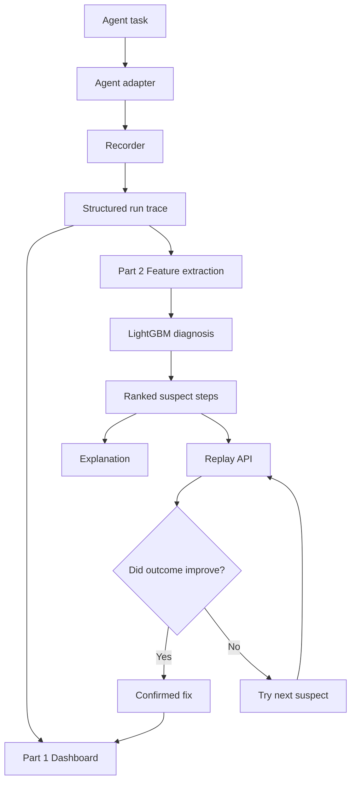

<div align="center">

# BLACK BOX
### The flight recorder, debugger, and recovery system for AI agents

**Observe what happened. Find where it went wrong. Verify the fix.**

[](https://www.python.org/)
[](https://fastapi.tiangolo.com/)
[](https://lightgbm.readthedocs.io/)
[](#license)

*A full-stack observability and diagnosis platform for multi-step AI-agent workflows.*

</div>

---

## Overview

AI agents can fail in ways that are difficult to debug: a model may misunderstand a value, a tool may return an incorrect result, or one bad intermediate step may silently corrupt everything that follows.

**Black Box** makes those failures inspectable and testable. It records agent executions as structured, step-by-step traces; injects controlled faults; ranks suspicious steps with a learned diagnosis model; and uses replay to test whether a proposed correction actually changes the outcome.

The project is organized into two connected parts:

| Component | Responsibility |
|---|---|
| **Part 1 — Recorder & Replay** (`blackbox_part 1/`) | Runs agents, records traces, injects faults, restores unaffected state during replay, and provides the interactive dashboard. |
| **Part 2 — Diagnosis & Verification** (`part2/`) | Trains a LightGBM model to rank likely faulty steps, exposes the diagnosis API, evaluates performance, and verifies candidate fixes through replay. |
| **Shared contract** (`contract/`) | Defines the run format and API contract used to connect both parts. |

### What you can do

- **Record agent runs:** capture each model call, tool call, decision, output, timing, and error in a structured run file.
- **Reproduce failures:** inject controlled faults and retain the exact step label for evaluation.
- **Diagnose failures:** score and rank suspicious steps using framework-agnostic signals and decisive evidence.
- **Explain a diagnosis:** generate a readable summary of the likely root cause, how it propagated, and a suggested fix.
- **Replay intelligently:** edit or retry a step while reusing unaffected outputs from the original trace.
- **Verify a fix:** replay top-ranked suspects and check whether the run outcome changes.
- **Inspect everything:** explore run history, filters, timelines, suspects, explanations, and replay results in the dashboard.

---

## Architecture



### Services and local ports

| Service | Default URL | Purpose |
|---|---|---|
| Dashboard | `http://localhost:8501` | Browse runs, inspect timelines, diagnose, explain, and replay |
| Replay API (Part 1) | `http://localhost:8000` | Re-execute a run from a selected step |
| Diagnosis API (Part 2) | `http://localhost:8001` | Return ranked suspicious steps and explanations |
| Replay API docs | `http://localhost:8000/docs` | Interactive API documentation |
| Diagnosis API docs | `http://localhost:8001/docs` | Interactive API documentation |

---

## Prerequisites

Install the following before starting:

| Requirement | Version / Notes |
|---|---|
| **Python** | 3.10 or newer |
| **pip** | Included with standard Python installations |
| **Git** | Only needed to clone or update the repository |
| **Ollama** *(optional)* | Needed only for local LLMs such as `llama3` or `mistral` |
| **Provider API key** *(optional)* | Needed only when using hosted models such as Groq, OpenAI, Gemini, or OpenRouter |

> **Windows note:** During Python installation, enable **Add Python to PATH**. The commands below use PowerShell.

The core dashboard, APIs, simulated data, tests, and mock models can run without an LLM API key. Hosted or local LLMs are optional.

---

## Quick start — Windows PowerShell

### 1. Get the project

If you have not cloned the repository yet:

```powershell
git clone https://github.com/rootdenied/BNB26_DIVISIONBYZERO_Internal_Round.git
cd BNB26_DIVISIONBYZERO_Internal_Round
```

If the project is already on your computer, open PowerShell in the repository root — the folder containing `run_all.py`, `part2/`, and `blackbox_part 1/`.

### 2. Create and activate a virtual environment

```powershell
py -3.10 -m venv .venv
.\.venv\Scripts\Activate.ps1
```

If PowerShell blocks activation for the current session, run:

```powershell
Set-ExecutionPolicy -Scope Process -ExecutionPolicy Bypass
.\.venv\Scripts\Activate.ps1
```

If `py -3.10` is unavailable, use an installed Python 3.10+ version:

```powershell
python -m venv .venv
.\.venv\Scripts\Activate.ps1
```

### 3. Install dependencies

Run these commands from the **repository root**:

```powershell
python -m pip install --upgrade pip
pip install -r "blackbox_part 1/requirements.txt"
pip install -r part2/requirements.txt
```

### 4. Generate the diagnosis model

The launcher expects `part2/model.txt` to exist. Generate the simulated dataset and train the model:

```powershell
python -m part2.make_data
python -m part2.train
```

This creates the Part 2 data/model artifacts locally. The generated `part2/data/` directory is intentionally ignored by Git.

### 5. Start the complete application

```powershell
python run_all.py
```

The launcher starts the diagnosis API, replay API, and dashboard. Keep this terminal open.

Open the dashboard:

**http://localhost:8501**

To stop the services, press `Ctrl+C` in the terminal running `run_all.py`.

> **Important:** Open a run and check the **Source** caption under “Top suspects”. It should say `diagnose API`. If it says `built-in mock`, the Part 2 API is not connected and the UI is using its fallback diagnosis.

---

## First run: explore the dashboard

1. Open **Activity** to browse recorded runs.
2. Use the filters to narrow by outcome, status, injected fault, model, or framework.
3. Select a run to inspect its step-by-step timeline.
4. Review the ranked suspects and their evidence.
5. Open **Why did it fail?** and select **Explain this failure** for a plain-language explanation.
6. Use edit-and-replay to test a correction and inspect whether the outcome changes.
7. Open **Results** to view the evaluation report in `part2/results.md`.

The project also retains a Streamlit interface. To launch it separately, stop the combined launcher and run:

```powershell
cd "blackbox_part 1"
python start.py --streamlit
```

---

## Run Part 1 independently

Part 1 can be tested without Part 2 or a hosted LLM.

From the repository root:

```powershell
cd "blackbox_part 1"
python -m pytest -q tests
python run_batch.py --models mock-large,mock-small
python contract\validate.py runs
python start.py --mock-diagnose
```

The mock models are deterministic, offline stand-ins. They support the built-in task shapes and are useful for exercising recording, fault injection, replay, and the UI without API costs.

To run Part 1's verification demo, open a second terminal, activate the same virtual environment, then run:

```powershell
cd "YOUR_REPOSITORY_PATH"
python -m part2.mocks.mock_verify
```

Replace `YOUR_REPOSITORY_PATH` with the actual repository directory.

---

## Use real language models (optional)

Black Box supports local Ollama models and hosted OpenAI-compatible providers.

### Option A — Ollama (local)

1. Install and start [Ollama](https://ollama.com/).
2. Pull a model:

```powershell
ollama pull llama3
# Optional:
ollama pull mistral
```

3. From the repository root, run real-model batches:

```powershell
cd "blackbox_part 1"
python run_batch.py --models llama3,mistral --tasks 10 --repeat 2
```

To use the LangGraph adapter:

```powershell
python run_batch.py --models llama3 --tasks 10 --framework langgraph
```

### Option B — Hosted API

Supported provider prefixes:

| Model ID format | Environment variable |
|---|---|
| `groq:<model>` | `GROQ_API_KEY` |
| `openai:<model>` | `OPENAI_API_KEY` |
| `gemini:<model>` | `GEMINI_API_KEY` |
| `openrouter:<model>` | `OPENROUTER_API_KEY` |
| `api:<model>` | `BLACKBOX_LLM_BASE_URL` and `BLACKBOX_LLM_API_KEY` |

Example using Groq (PowerShell):

```powershell
$env:GROQ_API_KEY = "YOUR_GROQ_API_KEY"

cd "blackbox_part 1"
python run_batch.py --models groq:YOUR_MODEL_ID --tasks 10 --repeat 2
```

Replace the placeholder with a model ID supported by your provider. Set the environment variable in the same terminal **before** starting the process. Do not commit API keys or `.env` files.

For a custom OpenAI-compatible endpoint:

```powershell
$env:BLACKBOX_LLM_BASE_URL = "https://YOUR_API_BASE/v1"
$env:BLACKBOX_LLM_API_KEY = "YOUR_API_KEY"
python run_batch.py --models api:YOUR_MODEL_ID --tasks 10 --repeat 2
```

---

## Part 2 — train, verify, and evaluate

Run these commands from the **repository root**, with the virtual environment active.

### Generate simulated data and train

```powershell
python -m part2.make_data
python -m part2.train
```

### Validate Part 1 run files

```powershell
python -m part2.validate "blackbox_part 1/runs"
```

Validation reports contract mismatches; it does not silently modify the source run files.

### Train with real Part 1 runs

```powershell
python -m part2.train --real-dir "blackbox_part 1/runs"
```

To include replay-confirmed training examples:

```powershell
python -m part2.train --real-dir "blackbox_part 1/runs" --confirmed
```

### Verify suspected steps through the live replay API

Start the full application in another terminal using `python run_all.py`, then run:

```powershell
python -m part2.verify --real-dir "blackbox_part 1/runs" --replay-url http://localhost:8000/replay
```

### Evaluate and write the report

```powershell
python -m part2.eval --real-dir "blackbox_part 1/runs" --confirmed
```

The report is written to `part2/results.md`.

Optional LLM-judge comparison with Ollama:

```powershell
python -m part2.eval --real-dir "blackbox_part 1/runs" --confirmed --llm llama3 --llm-n 40
```

Or with Groq:

```powershell
$env:GROQ_API_KEY = "YOUR_GROQ_API_KEY"
python -m part2.eval --real-dir "blackbox_part 1/runs" --confirmed --llm groq:YOUR_MODEL_ID --llm-n 40
```

> **Evaluation integrity:** `python -m part2.train --all --real-dir "blackbox_part 1/runs"` is intended for a live demo model trained on every available setup. Do not use its evaluation or verification numbers as held-out performance results.

---

## Generate more recorded runs

From the Part 1 directory:

```powershell
cd "blackbox_part 1"
```

Examples:

```powershell
# Offline mock runs
python run_batch.py --models mock-large,mock-small

# Local Ollama models
python run_batch.py --models llama3,mistral --tasks 10 --repeat 2

# Hosted model (set the key first)
$env:GROQ_API_KEY = "YOUR_GROQ_API_KEY"
python run_batch.py --models groq:YOUR_MODEL_ID --tasks 10 --repeat 2

# LangGraph framework
python run_batch.py --models llama3 --tasks 10 --framework langgraph
```

Runs are saved under `blackbox_part 1/runs/` in the shared contract format. Real `mistral` and `langgraph` runs are treated as unseen setups by the Part 2 evaluation workflow.

---

## API overview

Both APIs expose interactive OpenAPI documentation when running:

- Replay API: `http://localhost:8000/docs`
- Diagnosis API: `http://localhost:8001/docs`

The shared contract and schemas are in `contract/`. Part 1 also contains its own contract copy under `blackbox_part 1/contract/`.

Key integration points:

| Endpoint / artifact | Direction | Description |
|---|---|---|
| `runs/run_XXXX.json` | Part 1 → Part 2 | Structured run trace |
| `POST /diagnose` | Dashboard → Part 2 | Ranked suspect steps |
| `POST /replay` | Part 2 → Part 1 | Replay a run with a proposed edit |
| `POST /explain` | Dashboard → Part 2 | Explanation based on suspects and evidence |

See `contract/schema.md`, `blackbox_part 1/contract/api.md`, and the JSON schemas for exact payload formats.

---

## Tests

Run Part 1's offline test suite from its directory:

```powershell
cd "blackbox_part 1"
python -m pytest -q tests
```

Run contract validation from the repository root:

```powershell
python -m part2.validate "blackbox_part 1/runs"
```

The mock-model path is designed for offline development and does not require provider credentials.

---

## Repository layout

```text
.
├── README.md
├── run_all.py                  # Starts the complete local demo
├── contract/                   # Shared run/API contract
├── part2/
│   ├── diagnose_api.py         # Diagnosis and explanation API
│   ├── model.py                # LightGBM model and ranking logic
│   ├── signals.py              # Step-level features and evidence
│   ├── train.py                # Training pipeline
│   ├── eval.py                 # Evaluation and report generation
│   ├── verify.py               # Replay-based verification loop
│   ├── validate.py             # Run contract validation
│   ├── data.py                 # Dataset loading and split logic
│   ├── results.md              # Evaluation report
│   └── requirements.txt
└── blackbox_part 1/
    ├── app.py                  # Streamlit application
    ├── ui_api.py               # Dashboard backend
    ├── replay_api.py           # Replay service
    ├── recorder.py             # Execution recorder
    ├── replay.py               # Replay and state restoration
    ├── adapters/               # Agent/framework adapters
    ├── contract/               # Part 1 contract copy and schemas
    ├── runs/                   # Recorded run JSON files
    ├── tests/                  # Part 1 tests
    └── requirements.txt
```

---

## Troubleshooting

<details>
<summary><strong>PowerShell says script execution is disabled</strong></summary>

Run this for the current terminal only, then activate the environment again:

```powershell
Set-ExecutionPolicy -Scope Process -ExecutionPolicy Bypass
.\.venv\Scripts\Activate.ps1
```
</details>

<details>
<summary><strong><code>python</code> or <code>py</code> is not recognized</strong></summary>

Reinstall Python 3.10+ and enable **Add Python to PATH**, then close and reopen PowerShell.
</details>

<details>
<summary><strong>The launcher says there is no trained model</strong></summary>

Run the data-generation and training commands from the repository root:

```powershell
python -m part2.make_data
python -m part2.train
```
</details>

<details>
<summary><strong>The dashboard uses “built-in mock” instead of the diagnosis API</strong></summary>

Confirm the diagnosis API is running on port `8001`. The combined launcher starts it automatically. Check `http://localhost:8001/docs` and restart `python run_all.py` if needed.
</details>

<details>
<summary><strong>A port is already in use</strong></summary>

Stop the other process using ports `8000`, `8001`, or `8501`, then restart the launcher. The dashboard and APIs use these ports by default.
</details>

<details>
<summary><strong>Hosted model calls fail</strong></summary>

Check that the provider key is set in the same PowerShell session, the model ID is valid for that provider, and the account has available quota. For example:

```powershell
$env:GROQ_API_KEY = "YOUR_GROQ_API_KEY"
```
</details>

<details>
<summary><strong>Part 2 cannot find real runs</strong></summary>

Run commands from the repository root and quote the directory because its name contains a space:

```powershell
python -m part2.validate "blackbox_part 1/runs"
```
</details>

---

## Data, generated files, and secrets

- Keep API keys, access tokens, and private credentials out of Git.
- Generated Part 2 datasets and trained artifacts may be recreated with `part2.make_data` and `part2.train`.
- Run traces can contain prompts, outputs, and task data. Review them before publishing or sharing.
- Do not commit local virtual environments, Python caches, or temporary files.
- The repository's `.gitignore` excludes `part2/data/`, Python bytecode, and cache artifacts; review it before adding new generated data.

---

## License

No license file was identified in the supplied project archive. Unless the repository owner adds a license, assume the code is **all rights reserved** and obtain permission before reuse or redistribution.

---

<div align="center">

**BLACK BOX** · Making agent failures observable, explainable, and testable.

</div>
